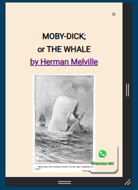
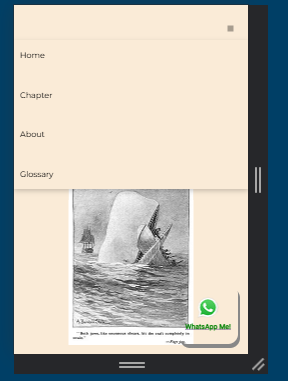

# Styling Hamburger Menu in Navbar with DOM

This project focuses on creating a navigation bar using CSS and DOM. The first version uses display: inline-block, which is then iterated to display: flex for a more flexible layout. The project also implements media queries to make the navbar responsive across different screen sizes. The HTML content uses excerpts from Moby-Dick by Herman Melville.

## Preview




## Getting Started
1. Clone this project:
```
git clone https://github.com/ranandasatria/fgo24-dom-navbar
```

2. Install the depedencies:
```
npm install
```

3. Run the project:
```
npm run dev
```

4. The project will be runnning at:
``` 
http://localhost:8080
```

## Depedencies

This project uses Node.js. Make sure you have Node.js installed on your machine.

- live-server: to simulate an HTTP server in a local environment.

## How to contribute

Please open a Pull Request (PR) to contribute to this project.
Your PR will be reviewed and merged if necessary.

## License

This project following MIT License.

## Copyright
&copy; 2025 Kodacademy


